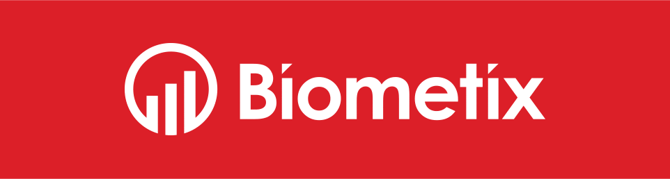
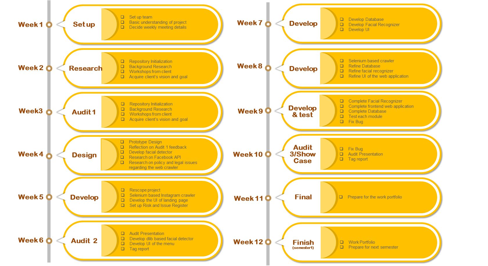
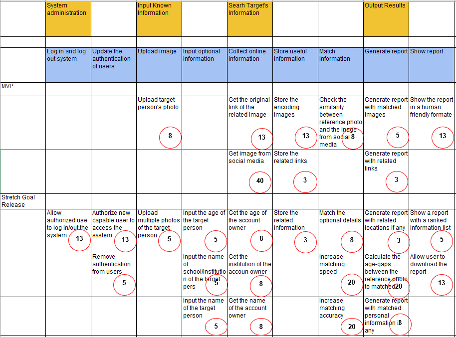
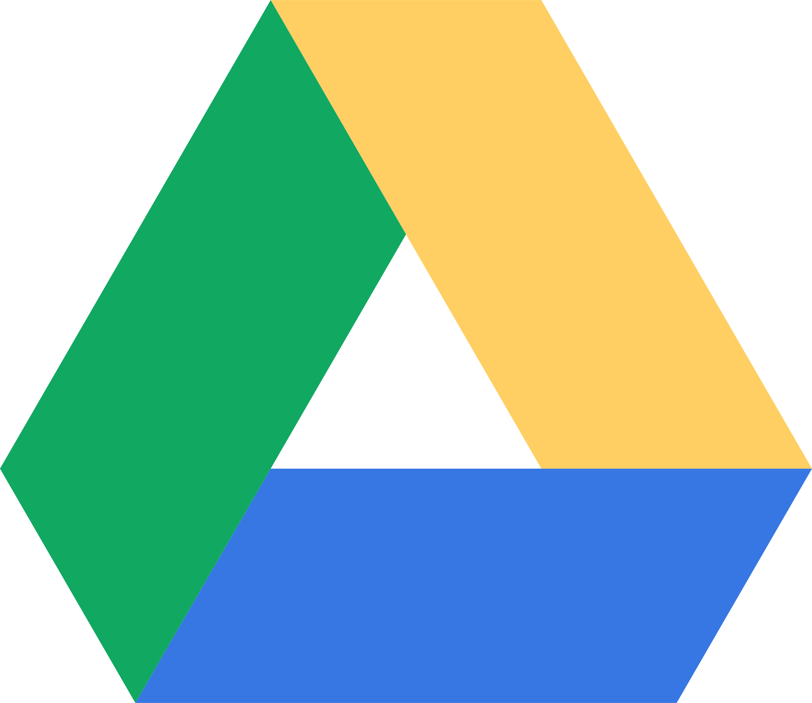

# Computer Science: Biometric Face Miner (18-S2-2-C Biometric)

## Useful Links

#### Repository Navigation

| Repository | Project Overview | WebApp | Team | 
|:---------- |:---------------- |:--------- |:---- |
| - [Google Drive](https://drive.google.com/drive/folders/1jj5zrdwBPqCvNlQ68OFNXhcOWh3Il0Os?usp=sharing) - [Timeline](#timeline) - [Tools](#tools) | - [Project Brief](https://drive.google.com/open?id=1xwDhYeVIRwBh8lRB-zfICJZdTMRLvQvDJ0LzDFNLqCM) - [Client's Vision](#clients-vision) - [Project Purpose](#project-purpose) - [Project Scope](#project-scope) - [Stakeholder](#stakeholders) - [Risks and Constraints](#risks-and-constraints) - [Ethics and Privacy](#ethics-and-privacy) | - [Risk Register](https://drive.google.com/drive/folders/10KlG3a6lRrfOhSusa5bzmWJK7gW91-On) - [Issues Register](https://drive.google.com/drive/folders/10KlG3a6lRrfOhSusa5bzmWJK7gW91-On) - [Requirements](#requirements) - [User Story Map](#user-story-map) - [Web Crawler](https://drive.google.com/open?id=1ww-_cwcEV6IMJK876N1pE56TZXIj7Erd) | - [Contributors](#contributors) - [Feedback](#feedback) - [Meetings](#meetings-schedule) |

#### Google Drive Navigation

| Audit | Feedback | Poster | WebApp | Team |
|:----- |:-------- |:------ |:--------- |:---- |
| - [Audit 1](https://drive.google.com/open?id=1PrCGEQ_aF_bkZdunnKWl4UeEOKxKNIGR) - [Audit 2](https://drive.google.com/open?id=1xXcYbLJDdpUgYEtV56D9iRUcbrc2IyH6) - [Audit 3](https://drive.google.com/open?id=1rfJDGoTTe5nuVuiEL3vZnTTvl2YqcYCX) | - [Audit 1](https://docs.google.com/document/d/1QJcWVouzuBs7rgKZgrM_6TJY6r6JJTY1MXhIVGOGUbA) - [Audit 2](https://drive.google.com/drive/folders/1cT0xEBoQ2fQzqcWKFBpzmkcUhrDbW5f8) - [Audit 3](https://drive.google.com/drive/folders/1cT0xEBoQ2fQzqcWKFBpzmkcUhrDbW5f8) - [Decisions](https://drive.google.com/drive/folders/1jQbEnGZykVcfUMC5uvKerlBhsut7r2no) | - [Posters](https://drive.google.com/open?id=1TF02aTuIMEBU0XVklH5Q-RD9oR-6p16a) | - WebApp - [Research](https://drive.google.com/drive/folders/1M2muiFjoqyDacXrlSilKqe_V4hUV883-) | - [Audit 1 Timeline](https://drive.google.com/open?id=1oSMVarR9-24Cyj9i--JOPRIZik4ZdzHHSYZMjMTHrX4) - [Audit 2 Timeline](https://drive.google.com/open?id=1rmJU119NoVQmF2LeczUYYzLnwP3Mypo8VZ1grxbyods) - [Audit 3 Timeline](https://drive.google.com/open?id=12N29F5SvfnQrR_hQ8r-osB_ipP4JStbK_qyaYZA0B_8) |

## Client's Vision

Biometix' vision involves an intuitively designed program for Government employees to utilize the faces of already known persons of interest
and extract their information through social network sites. If the person of interest is found on social network sites through facial
recognition, the collected data will be provided to the operator to catch criminals or help potential victims of exploitation.

## Project Purpose

Today, law enforcement employs a great number of resources to locate criminals and persons of interest. This is due to the natural difficulty
in finding one person in large groups of people. Our application aims to resolve this issue by allowing law enforcement to find persons
of interest with photos of their faces. Provided faces will be learnt by a neural network which then will traverse through various social
network sites in order to find a potential biometric match(es).

## Project Scope

The team agreed to the provided [project brief](https://drive.google.com/open?id=1xwDhYeVIRwBh8lRB-zfICJZdTMRLvQvDJ0LzDFNLqCM) and decided
to create a functional demo application that meets the MVP by the end of week 10 of semester 1 for the clients. The second semester will be the development of the stretch goals.

## Requirements

A functional application is defined by:
1. Intuitively designed web application that accepts photo(s) of a face and location. 
2. Database containing information of faces, its metadata and their social network sites. 
3. Online crawler that detects human faces and extracts relevant information. 
4. Face recognizer that detects and matches provided face(s) with a face(s) in the gallery database. 
5. Automatically generates a general report that shows the process. 

## Stakeholders

In-depth analysis of stakeholders is documented in our [wiki](https://gitlab.cecs.anu.edu.au/u6058768/CBiometric/wikis/stakeholders).

## Risks and Constraints

Two major risks the team will face will be issues surrounding time management, and any issues regarding the security of the application.
1. **Time management and post-production** 
This field of development introduces the team to new challenges including a still ambiguous time frame. Furthermore, heavy dependency on
external APIs, privacy policy and data format may call for an overhaul of the application if the dependencies changed. Dependency risks
carry along to post-production of the application.

2. **Security and privacy** 
The database containing the collected data must be secure due to the sensitivity of the data. Risks concerning the privacy of said data will
be closely monitored throughout the application development.

3. **Regulations** 

4. **More detail of risk register can be found [here](https://drive.google.com/drive/folders/10KlG3a6lRrfOhSusa5bzmWJK7gW91-On)** 

5. **More detail of issue register can be found [here](https://drive.google.com/drive/folders/10KlG3a6lRrfOhSusa5bzmWJK7gW91-On)** 

## Ethics and Privacy

In-depth analysis of ethics and privacy is documented in our [wiki](https://gitlab.cecs.anu.edu.au/u6058768/CBiometric/wikis/Ethics-and-Privacy).

In-depth research into the privacy policy of various social network sites proved that the collection and the usage of public users' data
is not possible without the help of the law enforcement. Therefore, the web crawler will not be
created during the first semester of Tech Launcher. The reasoning behind the decision can be found [here](https://drive.google.com/open?id=1BtH9Vf3NW7HzC9t1tlbWU7mSLfbqrMsp)

<!--- 
Original Ethics and Privacy by Nick: Crawl photo from social media that are only visible to public users by using the API provided by the respective sites. 
This is unethical to crawl public that are private to us as a public user. As this is a violation in privacy. We will not crawl for photo’s that are not 
assessible by public users. We will only crawl and store information that are listed and able to be viewed by anyone. We will not crawl and store information 
that are private thru unethical crawling methods. Such as bypassing the security and hack into the database to get the information that are private.
We will not let public to access the data stored in the database. As others may use the info inside the database for illegal activities.
The web application will only be available to users that had gain approval from Biometix (Our Client). This web application will not be available to open
market and public users. Our team will also not be using this web application for personal reasoning and personal benefit. We will only use the application
while developing and testing the web application. We will follow the rules and regulations stated by the open source owner if we are using any open source 
codes and provide the details to the open source website and owner’s contact details.
-->

## Development

#### 

## Feedback

Every stakeholders' feedback from each audit is carefully analysed and considered for the future of the project. The full analysis and responses
from the feedback can be found on [Google Drive](https://drive.google.com/drive/folders/1cT0xEBoQ2fQzqcWKFBpzmkcUhrDbW5f8).

## Meetings: [Schedule](https://drive.google.com/drive/folders/1M2CMJR2a78yCdkdga1OyoozeXXlQKyrM?usp=sharing)

### [Team Meetings](https://drive.google.com/open?id=1y6ehAtEK3uFP3MRVVQedlFk8gEbUjR3c)
Weekly team meeting typically on Thursday 2:00 pm - 4:00 pm. This meeting is essential for the review of last week's work and the current progress
as well as the discussion of future weeks' work. In-person meetings help members voice their ideas, opinions and even struggles with
the project.

### [Tutor Meetings](https://drive.google.com/open?id=1Oemr2KFHwajXC21Cmq8fAmJCyIF8y721)
Weekly tutorial on Wednesday 10:00 am - 12:00 pm. Tutorials help the team prepare the audits while getting feedback from the tutor and the
shadow team about the progress.
 
### [Client Meetings](https://drive.google.com/open?id=1ySxhDXvbdY2_EL0pKNbBoaxz9-U7bofj)
Fortnightly client meetings on Monday 4:00pm - 5:00pm. Client meetings allow the team members and the clients to easily and quickly communicate
about the project's progress and specifications.

## Timeline

Updated to v2.1

## User Story Map

Updated to v2.2

## Contributors

| Name | Uni ID | Role | Contact |
|:----:|:------:| ---- |:-------:|
| **Kun Du (Derek)** | [u6261200](https://gitlab.cecs.anu.edu.au/u6261200) | - Web Crawling - Facial Recognizer - Quality Control | [e-mail](mailto:u6261200@anu.edu.au) |
| **Woojin Ra** | [u6058768](https://gitlab.cecs.anu.edu.au/u6058768) | - Spokesperson - Repo Maintenance - Web Development - Web Crawling | [e-mail](mailto:u6058768@anu.edu.au) |
| **Yiqin Xu** | [u6358321](https://gitlab.cecs.anu.edu.au/u6358321) | - Facial Recognizer - Meeting Scribe - Databases - Issue Register | [e-mail](mailto:u6358321@anu.edu.au) |
| **Xiaocheng Xu (Rex)** | [u6279867](https://gitlab.cecs.anu.edu.au/u6279867) | - Vice Spokesperson - Facial Recognizer - Databases - Scheduling | [e-mail](mailto:u6279867@anu.edu.au) |
| **Wing Chee Yeung (Nick)** | [u5121850](https://gitlab.cecs.anu.edu.au/u5121850) | - Not Available | [e-mail](mailto:u5121850@anu.edu.au) |
| **Ying Zhao** | [u6413153](https://gitlab.cecs.anu.edu.au/u6413153) | - Facial Recognizer - Web Development - Quality Control - Risk Register | [e-mail](mailto:u6413153@anu.edu.au) |

## Tools

**GitLab**
offers a wide variety of features that are useful for software management. The team will utilize branches, issues and commit functions
to minimize conflicts regarding parallel workflow.

**Python**
is an interpreted high-level programming language for general-purpose programming. It will be used for facial recognition as well as the web crawler.

**OpenCV**
offers powerful tools for image pre-processing as well as provide a quick implementation of basic facial detection and recognition.

**TensorFlow**
allows easy implementation of a neural network that will be used for biometric detection and matching in this project. This Python framework
was chosen to match the Biometix's conventions for a smooth handover.

**MERN** combines *MongoDB*, *Express*, *React* and *nodeJS* into one framework for both the backend and the front end of the project.
This framework was also chosen to match the convention of Biometix for smooth handover in the future. Using what is familiar with Biometix 
further allows the team to learn from our clients through mini-workshops.

**Google Drive** will be used to manage documents containing meeting minutes, planning, decisions and more. This allows the team to view
and edit important files at once.

**Slack** was chosen as the main mode of communication between the team members and the clients. We found that it was best to have different channels 
for different agendas. This made it easier for all of us to keep track of conversations.

